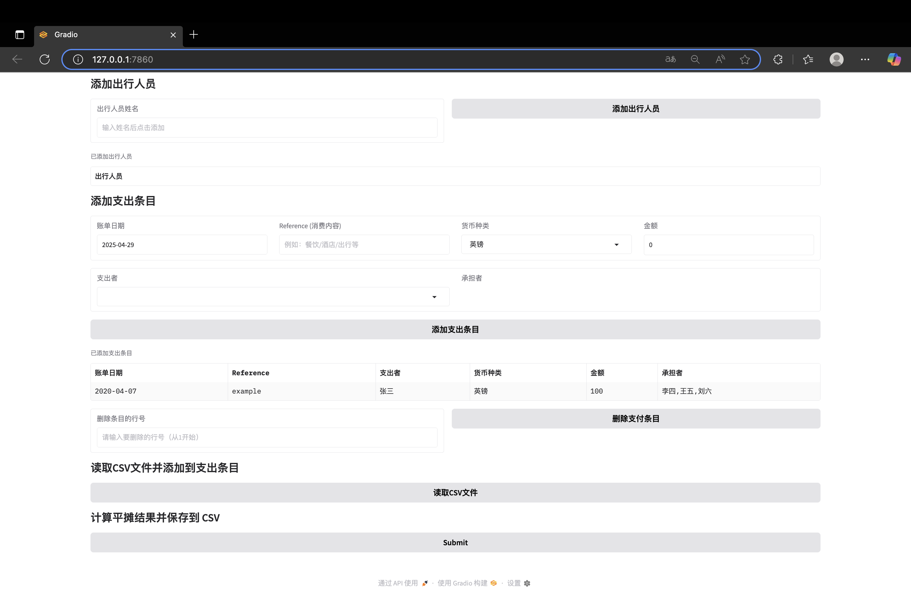

# Easy_Split 💰✈️

一个用于多人出行场景下的【多币种账单记录与平摊工具】。使用 Gradio 构建的图形界面，支持：

- 多人出行人员管理
- 多币种支出条目录入（支持英镑/欧元/人民币）
- 实时汇率转换
- 自动计算简化后的转账方案
- 支持账单 CSV 导入导出

## 🚀 项目亮点

- 📊 **实时货币汇率转换**：自动调用 `exchangerate.host` API，将所有币种统一折算为英镑。
- 🧾 **清晰转账方案**：通过构建净额矩阵，只展示必要的最简转账路径。
- 💡 **友好可视化界面**：基于 Gradio 快速构建，无需命令行操作。

---

## 🛠️ 安装方式

推荐使用虚拟环境：

### 方法一：使用 `requirements.txt`

```bash
python3 -m venv venv
source venv/bin/activate  # Windows 使用 venv\Scripts\activate
pip install -r requirements.txt
```

### 方法二：使用 Conda 环境

```bash
conda env create -f environment.yml
conda activate easy_split
```

---

## ▶️ 启动使用

在终端运行：

```bash
python easy_split.py
```

启动后浏览器中会自动打开 Gradio 界面，支持你：

1. 添加出行人员
2. 添加或导入支出条目（支持多个承担者）
3. 计算并查看平摊结果（支持保存 CSV）
4. 查看详细的英镑平账矩阵和最优转账方案

---

## 📂 文件结构说明

```text
├── easy_split.py            # 主程序文件（含 Gradio UI 和逻辑）
├── trip_expenses.csv        # 存储账单条目的 CSV 文件（自动生成）
├── LICENSE                  # 开源许可证（MIT）
├── requirements.txt         # pip 安装依赖
├── environment.yml          # conda 环境配置
└── README.md                # 使用说明文档
```

---

## 📸 使用界面预览

> *以下为主要操作界面*


- ✅ 出行人员添加  
- ✅ 多币种账单录入（支持勾选多个承担者）  
- ✅ 支出列表支持删除、加载CSV  
- ✅ 汇率自动换算，展示清晰平账结果  

---

## 🧾 CSV 格式说明

程序支持自动保存与读取账单记录，格式如下：

| 账单日期 | Reference | 支出者 | 货币种类 | 金额 | 承担者1, 承担者2,... |
|----------|-----------|--------|----------|------|------------------------|
| 2025-04-29 | 餐饮 | Alice | 人民币 | 300 | Alice,Bob |

---

## 🔗 汇率来源说明

本项目使用公开汇率 API：

- 来源：[`https://api.exchangerate.host`](https://exchangerate.host/)
- 汇率基准：以 **GBP（英镑）** 为基准进行折算

若 API 请求失败，程序将使用内置汇率：

- 欧元：0.86
- 人民币：0.11
- 英镑：1.0（基准）

---

## 🪪 License

本项目采用 MIT 协议开源，欢迎修改与再发布。

---

## 🙋‍♀️ Q&A

> 若你希望添加微信支付/支付宝二维码扫码记录、多人确认功能、账单分类分析等功能，欢迎发起 Issue 或 PR！

